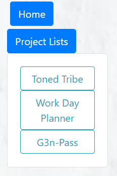
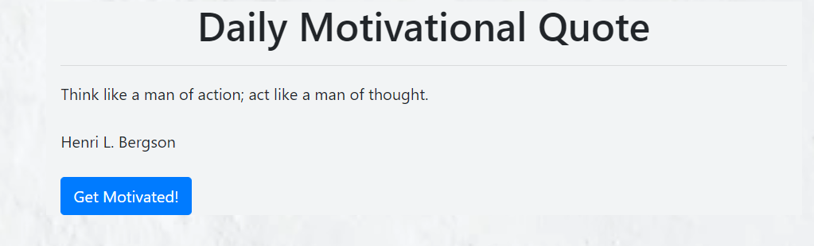

# Looking towards a brighter future!

 

As an aspiring web developer.  This application is to show my progress. I believe that with every step we take, no matter how small, will take us where we are ultimately destined to be.  To do so, one must have the courage and the fortitude to take that first step.

 

#

## Table of Contents

~[Purpose](#purpose)
~[Installation](#installation)
~[Features](#features)
~[Credits](#credit)

 

## Purpose

#

The purpose of this appliaction is to show my steps as I make my journey.  This allows access to current and past projects.  Though I move forward, I never walk alone.  This app encompasses what I have done, those who I have walked with and the daily motivations that urge me forward. 

 
 

## Installation

#

**To edit/use the application, please follow the steps to pull the repository from GitHub through Git Bash and pull the script into VSCode, provided all three items are already installed on a local network.**

Installation steps are as follows:

1. Access the repository at [Git Hub] https://github.com/Napica/Napica3
2. Click on the code section (in green) and clone the SSH key.
3. Once the SSH key is cloned, open the terminal through Git Bash.
4. Find or create the folder the user wants to work in and enter the following commands the the Git terminal:
   1. git clone [copied link] (_this will allow access the repository to the local computer._)
   2. git pull (_this will pull all the lines of script from the local repository._)
   3. code . (_This will extract the code and link the paths to VSCode for review/editing/uploading_)

#### [For Direct Access to GitHub provided application site]

Please click on the link below:

1.  https://napica.github.io/Napica3/

 

## Features

### Interactive search bar with home button (Now updated with extra projects) 
 

 

### Random Motivational Quotes generator

 

## License 

MIT Licensing 

## Credit

#

I would like to thank the help of my TA's/Tutors/Classmates for the assisstance in making this application possible.
